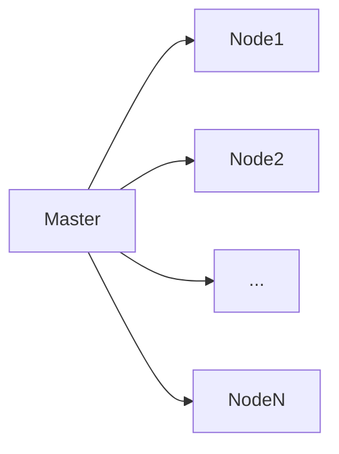
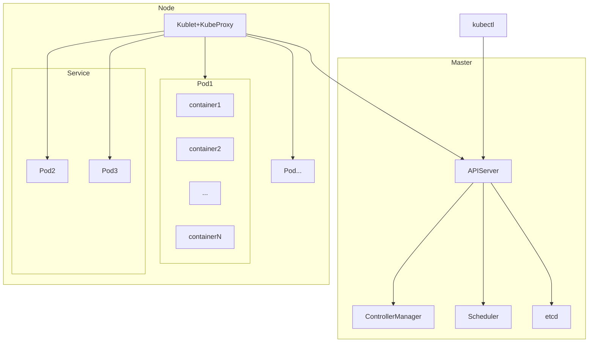

# Docker与K8S学习笔记

## 一个小故事

小A是一家初创公司的程序员，让我们来看一下Docker与K8S的应用场景。

### 没有Docker的时代：

公司买了一台新服务器，程序员小A部署好Nginx、MySQL、PHP等基础服务，然后开始愉快得部署业务代码并对外提供服务。

过了一个月，公司的用户急速增加，又买了5台服务器，小A还是一台一台部署基础服务，然后部署业务代码，小A郁闷了。

### 有Docker的时代：

公司买了一台新服务器，程序员小A部署好Nginx、MySQL、PHP等基础服务，然后开始愉快得部署业务代码并对外提供服务，**同时小A把需要部署的内容与部署过程用配置文件描述出来，并保存成一个镜像（Image）**，提交到公司的镜像仓库（Respository/Registery）。

过了一个月，公司的用户急速增加，又买了5台服务器，**小A在每台机器上拉取镜像（Image）并启动一个容器（Container）**，他还是很愉快。

又过了一年，公司又买了100台服务器，并且随着公司的发展，这次不只有一套业务代码，而是10套，小A好不容易逐个部署完，但是机器多了问题就多，服务隔三差五就出问题，小A又郁闷了。

### 有K8S的时代：

小A使用K8S管理这100台机器，定义好自己需要的服务配置，K8S会自动完成资源、服务的部署、调度与监控，小A还是那个愉快的少年。

## Docker

掌握四个概念，结合上面的小故事即可理解Docker的内容

* Image，镜像：描述了一个服务的环境、配置、基础服务等基本信息，是一个静态文件
* Container，容器：分配一定的资源，把镜像中的内容按描述的方式运行起来，就成为了容器
* Respository，镜像仓库：镜像多了不太容易管理，于是需要一个仓库存储镜像，以便大家需要的时候随时取用
* Registry，注册服务：想放到仓库的镜像太多了，需要有专人审核与管理，Registry就是这个角色，类似仓库管理员，其中DockerHub是官方的Registry服务

## K8S

容器多了以后，针对容器的一系列操作就都成了问题，部署、调度、删除、监控等等，K8S应运而生

### 基本架构

#### 主从

K8S是主从架构，由一个Master管理多个Node，其中每个Master和Node一般情况下都对应一台物理机。

Master主要负责管理Node，Node是真正执行计算的单位。


graph LR
	Master-->Node1
	Master-->Node2
	Master-->...
	Master-->NodeN


#### Master

Master中主要包含这四个服务：

* API Server：负责对外提供服务
* Scheduler：负责资源调度，主要是Pod的部署
* Controller Manager：负责Pod的监控与管理
* etcd：存储，只有API Server可读写

#### Node

Node中主要包含以下内容

* Pod：k8s资源调度的最小单位，一个Pod包含一个或多个容器（紧密相关的）
* Kublet：管理Pods，与Master通信
* Kube Proxy：为Pods提供代理
* Service：多个Pods会组成一个service对外提供服务

#### 整体

