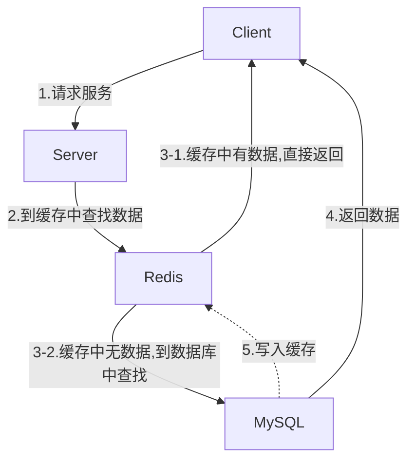

# 如何确保MySQL与Redis数据的一致性

## 系统架构

一般情况下，Redis都是作为client与MySQL间的一层缓存，尽量减少MySQL的读压力，数据流向如图所示：

## 具体问题

当MySQL中的数据发生更新时，就面临一个问题，如何确保MySQL与Redis数据的一致性，我们有两个选择：

1. 先更新MySQL，后删除(或更新)Redis
2. 先删除(或更新)Redis，后更新MySQL

但是不管使用其中哪种方式，都存在两个可能的问题：

1. 由于第一步与第二部并不是原子的，中间会存在较短的时间间隔，如果间隔时间内有请求到达，就可能会访问到不一致的数据。
2. 可能存在做完第一步，第二步还没来得及做，系统就挂了；这就会导致MySQL与Redis的数据一致

## 解决方案

### 最终一致性：容忍数据短时不一致，最终达到一致即可

可以采用先删除Redis，后更新MySQL的方式来保证最终一致性。

个人认为更新MySQL后还需要再删除一次，否则如果按顺序发生以下时间，数据将在较长时间（缓存时效周期 or 直到下一次更新）内不一致。

1. 删除Redis
2. 有请求到达，读取MySQL内容并写入Redis（此时写入的数据是旧的）
3. 更新MySQL
4. 删除Redis（再次删除可以确保Redis中的内容为最新数据）

### 强一致性：数据实时保持一致

引入第三方服务，订阅(监听)MySQL master节点的binlog，当binlog产生时，按binlog顺序更新Redis数据即可。比如阿里开源的canal组件

个人认为这里实现的”强一致性“也并不是真的”实时一致“，而是”近实时“，因为读取binlog并执行到Redis上，依然需要时间，只是这个时间会比较快而已。
